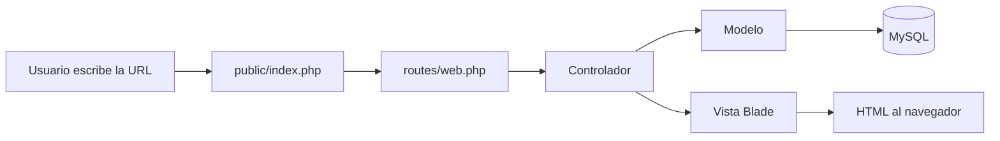
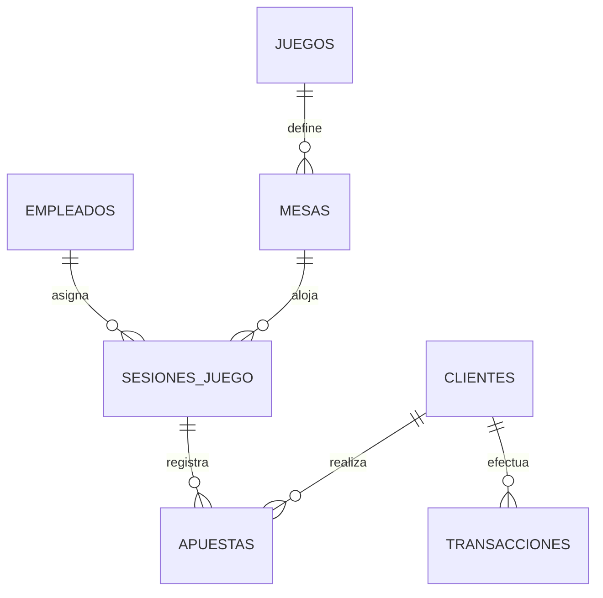

# Casino Fortuna - Sistema de Gestión Empresarial

Proyecto del curso **Software de Gestión Empresarial (COTECNOVA 2026)**.
ERP para un casino / área de juegos de azar, desarrollado con **Laravel** sobre **Docker (Laravel Sail)** y **MySQL**.

**Estado:** primer corte (entorno, autenticación, diseño base y primeras tablas).

---

## Tecnologías

| Componente | Versión / herramienta |
|---|---|
| Framework | Laravel 13 |
| Lenguaje | PHP 8.5 |
| Base de datos | MySQL 8.4 |
| Entorno | Docker + Laravel Sail (WSL2 / Ubuntu) |
| Autenticación | Laravel Breeze (Blade + Alpine.js) |
| Estilos | Tailwind CSS (Vite) |

## Cómo levantar el proyecto

```bash
git clone https://github.com/jamescanos/SoftwareGestionEmpresarial.git
cd SoftwareGestionEmpresarial
cp .env.example .env
./vendor/bin/sail up -d
./vendor/bin/sail composer install
./vendor/bin/sail php artisan key:generate
./vendor/bin/sail npm install && ./vendor/bin/sail npm run build
./vendor/bin/sail php artisan migrate --seed
```

La aplicación queda en `http://localhost:9090` (puerto definido en `APP_PORT`).

---

## Capítulo 1: Entorno de desarrollo

WSL2 con Ubuntu, Docker Desktop y Git configurado con token de acceso personal.
Los archivos del entorno inicial de la Clase 1 (PHP + MariaDB + phpMyAdmin) están en la carpeta `entorno-clase1/`.

---

## Capítulo 2: Instalación de Laravel

### Estructura de carpetas

| Carpeta | Función | En este proyecto |
|---|---|---|
| `app/` | Modelos, controladores y lógica de negocio | `Juego`, `Mesa`, `Cliente`, `MesaController` |
| `bootstrap/` | Arranque del framework | No se modifica |
| `config/` | Configuración (BD, correo, caché) | Sin cambios |
| `database/` | Migraciones, seeders y factories | Tablas del casino y datos de prueba |
| `public/` | Punto de entrada (`index.php`) y assets compilados | CSS/JS generados por Vite |
| `resources/` | Vistas Blade y assets sin compilar | Login, registro, dashboard, mesas |
| `routes/` | Definición de URLs | `web.php`, `auth.php` |
| `storage/` | Logs, caché y sesiones | Generado por Laravel |
| `vendor/` | Dependencias de Composer | No se sube a Git |
| `.env` | Variables de entorno | No se sube a Git |

### Flujo de una petición



Ejemplo real del proyecto: `/mesas` → ruta `mesas.index` → `MesaController@index` → modelo `Mesa` (con su `Juego`) → vista `resources/views/mesas/index.blade.php`.

### Variables de entorno (`.env`)

| Variable | Qué configura | Valor en este proyecto |
|---|---|---|
| `APP_NAME` | Nombre de la aplicación | `Casino Fortuna` |
| `APP_ENV` | Entorno | `local` |
| `APP_DEBUG` | Modo depuración | `true` (solo en desarrollo) |
| `APP_URL` | URL base | `http://localhost:9090` |
| `APP_PORT` | Puerto publicado por Sail | `9090` |
| `APP_LOCALE` | Idioma | `es` |
| `DB_CONNECTION` | Motor de BD | `mysql` |
| `DB_HOST` | Servidor de BD | `mysql` (nombre del servicio Docker, no `localhost`) |
| `DB_PORT` | Puerto de la BD | `3306` |
| `DB_DATABASE` | Nombre de la BD | `laravel` |
| `DB_USERNAME` / `DB_PASSWORD` | Credenciales | Valores por defecto de Sail |

El archivo `.env` está en `.gitignore` y **no se sube al repositorio**; se parte de `.env.example`.

### Patrón MVC aplicado al casino

- **Modelo:** representa los datos (`Juego`, `Mesa`, `Cliente`).
- **Vista:** lo que ve el usuario (`resources/views`).
- **Controlador:** recibe la petición, consulta el modelo y decide qué vista mostrar (`MesaController`).

---

## Capítulo 3: Autenticación y diseño visual

Autenticación con **Laravel Breeze**. Las rutas de los módulos están protegidas con el middleware `auth`: un usuario sin sesión es redirigido a `/login`.

### Cambios visuales realizados

- `layouts/guest.blade.php`: fondo con degradado, tarjeta blanca con borde dorado y logo de texto.
- `auth/login.blade.php` y `auth/register.blade.php`: formularios en español con la misma identidad visual.
- `dashboard.blade.php`: mensaje de bienvenida y tarjetas con indicadores (mesas activas, clientes, fichas en circulación).
- `layouts/navigation.blade.php`: marca del casino y enlaces a los módulos.
- `mesas/index.blade.php`: listado de mesas con estado en color.

### Paleta de colores

| Uso | Color (Tailwind) |
|---|---|
| Fondo de acceso | `red-900` → `gray-900` → `black` |
| Acento principal | `amber-500` / `amber-600` |
| Marca en el menú | `red-700` |
| Estado abierta | `green-100` / `green-700` |
| Estado cerrada | `red-100` / `red-700` |

### Fuentes y recursos

- Tipografía: **Figtree** (Bunny Fonts, incluida en Breeze).
- Iconografía: emoji 🎰 como logo provisional.
- Estilos: Tailwind CSS.

---

## Capítulo 4: Base de datos, modelos y relaciones

### Modelo entidad-relación



| Entidad | Estado |
|---|---|
| `juegos` | Implementada |
| `mesas` | Implementada |
| `clientes` | Implementada |
| `empleados`, `sesiones_juego`, `apuestas`, `transacciones` | Pendiente |

### Tablas implementadas

- **juegos:** `id`, `nombre`, `apuesta_min`, `apuesta_max`, `activo`, `timestamps`
- **mesas:** `id`, `juego_id` (FK → juegos, `onDelete cascade`), `estado`, `timestamps`
- **clientes:** `id`, `documento` (único), `nombre`, `fecha_nacimiento`, `nivel_vip`, `saldo_fichas`, `timestamps`

### Relación 1:N (Juegos → Mesas)

```php
// app/Models/Juego.php
public function mesas() { return $this->hasMany(Mesa::class); }

// app/Models/Mesa.php
public function juego() { return $this->belongsTo(Juego::class); }
```

### Seeders

- `JuegoSeeder`: Blackjack, Póker, Tragamonedas y Bacará (la Ruleta se creó desde Tinker).
- `ClienteSeeder`: 5 clientes de prueba con distintos niveles VIP.

```bash
./vendor/bin/sail php artisan db:seed --class=JuegoSeeder
./vendor/bin/sail php artisan db:seed --class=ClienteSeeder
```

---

## Integrantes

- Completar con los nombres del grupo
